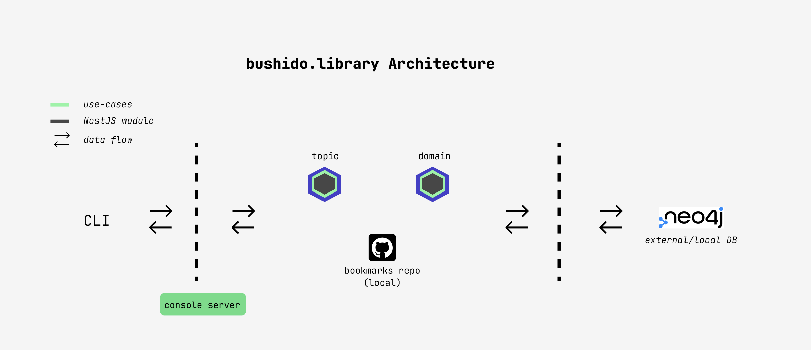

# Motivation

This repository is a CLI application to feed domains into a graph database as [Neo4J](https://neo4j.com/). Once the import finish, we have an endpoint to consume that information. That data, we could consume differently but one of the uses-case would be to render that in a web page

## Overview



The user interacts with CLI sending different commands to populate, update or health-check the domain library (graph db). There are two main parts in the application which are structured in different folders:

- __bookmarks__: All the domains that we want to add in our library and it follows, the tree data structure.
- __cli__: console server to interact with the database to save/delete domains. More info in [cli](./cli/README.md)

## Commands

> __Note!__ If we change the code and we want that change will be reflected in the commands, we need to create a reproducible build: `npm run build`

If you want to have an extended info about commnad go to [cli](./cli/README.md)

```bash
# Enter in the application file
cd cli
# Create the files to import
npm run bushido-cli generate
# First, import the topics in the graph DB
npm run bushido-cli import topic
# and then, the domains
npm run bushido-cli import domain
# EXTRA
npm run bushido-cli optimise-graph
npm run bushido-cli domain-url-check
```
