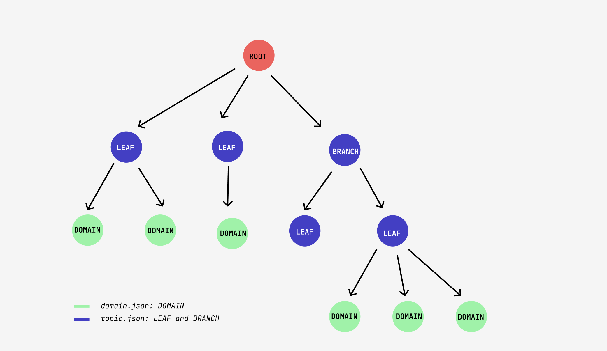

# Motivation

Bushido CLI, extracts from **bookmarks** folder all the information (JSON files) and then import it, in a the graph database.

## Description

The console application, analises the **bookmarks** [folder](../bookmarks/) and creates objets to generate the JSON files (located in *cli/export*). That files would be transformed form tree data structure to object type. 

First, the application finds in the bookmarks folder, two type of nodes to add in the `topic.json` file:

- BRANCH: These generic nodes, can have as a children, a *branch* or a *leaf*. This type of objects will never have *domains* nodes.
- LEAF: The last node before access to the *domains*

These node types will be named in general as a __topic__ and would be stored as we said in `topic.json`.

Once the `topic.json` is populated, all the nodes types that does not have any child, would be named as __domain__ and are going to be stored in `domain.json` file. That nodes contain the information of the domain as name, URL,...



## Development

Install the application modules to spin up the app and run it. The last command will force to restart the server each time a file is changed.

```bash
npm install
npm run start:dev
```

In other tab of the terminal run the commands, for example:

```bash
npm run bushido-cli import domain
```

## Commands

Before run the commands the project has to be compiled from TypeScript to JavaScript, execute or be in the develpment mode as above:

```bash
npm run build
```

Once the compilation finish, we are ready to run our commands:
Create the `topic.json` and `domain.json` files from the *bookmarks* folder.
NOTE: If export folder is not created in the `cli` folder, it throws error. So, before run the script, create `export` folder.

```bash
npm run bushido-cli generate
```

If the command is succesful, import the files as nodes in the graph database:

```bash
# First import the topics
npm run bushido-cli import topic
# After the domains
npm run bushido-cli import domain
```

## Extra Commands

Tidy up the nodes that don't have any child

```bash
npm run bushido-cli optimise-graph
```

For different reasons, it might be a possibility that some domains are not available (404). If we find some of that delete node

```bash
npm run bushido-cli domain-url-check
```

## GraphDB: Cypher queries of Neo4J

Delete all the database

```cypher
MATCH (n)
DETACH DELETE n
```

Delete specific node by ID

```cypher
MATCH (n)
WHERE ID(n)=1
DETACH DELETE n
```
